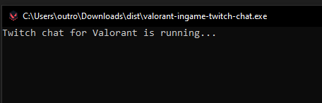
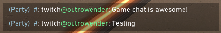

# valorant-ingame-twitch-chat.py

A script who shows your Twitch chat, private in your party chat!

Console:

Game:

## Why?
Sometimes what you need is just a small lightweight Twitch chat running inside your game for your cheap PC while you do a stream for your frieds.

## Q&A
### Everyone in my party will see my chat?
> No! Only you will see Twitch chat!

### I'll get a ban using this?
> No! This script uses [Valorant](https://github.com/techchrism/valorant-api-docs) and [Twitch.tv](https://dev.twitch.tv/docs/irc#getting-started-with-chat--chatbots) APIs, so theoricaly will not get you a ban.

### I need administrator privileges to use this?
> No! Such privilege isn't necessary!

### I need to disable my antivirus?
> Probably. Since this is new, it may be necessary that you mark as false positive in your antivirus program. This is open source and remember that you're free to read the code.
## How to use

1. [Download](https://github.com/outrowender/valorant-ingame-twitch-chat/releases) latest `valorant-ingame-twitch-chat.zip` from [releases](https://github.com/outrowender/valorant-ingame-twitch-chat/releases) page;
2. Unzip it on any folder from your PC;
3. Go to [twitchapps.com/tmi](https://twitchapps.com/tmi/) to get your Twitch API token;
4. Paste your API token inside `twitch-token.txt` in a single line, replacing anything there;
5. Open `twitch-channel.txt` and put your channel's name in a single line;
6. Open Valorant (it's important that you need to open the game BEFORE running the script);
7. Open `valorant-ingame-twitch-chat.exe` and let it run in background;
8. Your chat is now running inside the game;
9. Enjoy.

## Roadmap
- ✅ chat fully working in-game;
- 🔳 better chat formatting;
- 🔳 better emote support;
## Disclaimer

If you think this is interesting, please, leave a star!

This is my first python script, so it may have some bugs. If you see anything wrong, please report it thoug [issues](https://github.com/outrowender/valorant-ingame-twitch-chat/issues) page or my discord `outrowender#4692`. 
I'll be happy to fix them!

If you think something can be better, open a Pull Request!
